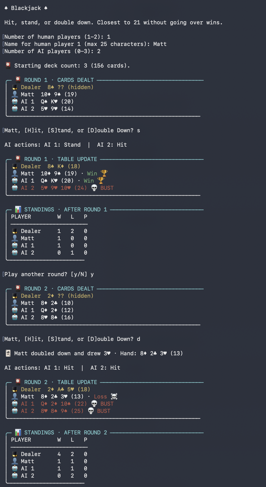

# Blackjack

A vanilla multiplayer blackjack game with a command-line interface and a reusable TypeScript game engine.

This first release supports one or two human players, zero to three AI players, and up to five total players at one table. There is no betting yet. The CLI keeps win, loss, and push standings for the current session.

## Play

Requires Node.js 22 or newer.

```bash
npm install
npm run dev
```

To compile and run the generated JavaScript:

```bash
npm run build
npm start
```

Run the tests with `npm test`.

See [CHANGELOG.md](CHANGELOG.md) for release history.

## CLI experience

- Table updates use clearly labeled, vertically stacked rows with player and dealer icons.
- Player and AI decisions are consolidated into one table update after the round resolves.
- The final table includes the dealer's score, outcome markers, and a 💀 BUST marker in place of a loss marker for eliminated hands.
- After every round, a vertical standings table shows wins, losses, and pushes for every player and the dealer. Dealer totals are recorded once per player comparison.



## Current rules

- Each player and the dealer receive two cards.
- Players may Hit, Stand, or Double Down on their initial two cards.
- Double Down draws exactly one card and then stands. Betting is not yet tracked.
- Aces count as 1 or 11, whichever produces the best hand.
- A hand over 21 busts; a total of 21 stands automatically.
- The dealer hits below 17 and stands on every 17 or higher.
- Each player independently wins, loses, or pushes against the dealer.
- Human names must contain 1–25 characters after surrounding whitespace is removed.

## Architecture

### Shared Game Engine

- **TypeScript** — Shared game rules, configuration, and typed game state.
- Handles shuffling, dealing, hand scoring, player actions, dealer behavior, and round outcomes.
- Runs locally for the CLI and on Cloudflare for the web version.
- Keeps game logic independent of input, display, and storage.

### CLI Version (implemented)

- **Node.js** — Runs the game engine.
- **Node.js Readline** — Handles interactive terminal input, including game setup and player actions.
- **Terminal output** — Displays cards, scores, and game results.
- **Local in-memory state** — Keeps the game active until the process exits; no backend connection or database required.

### Web Version

- **React + TypeScript** — Builds the browser interface.
- **Relay** — Fetches GraphQL data and manages the client-side cache.
- **GraphQL API** — Exposes visible game state and actions such as dealing, hitting, and standing.
- **Cloudflare Workers** — Hosts frontend assets and the GraphQL API.
- **Cloudflare Durable Objects** — Manages one game session per object, using the shared engine to validate actions and update game state.
- **Durable Object storage** — Persists session configuration and game state across idle periods and object restarts without a separate database service.
- **Secure, HTTP-only session cookie** — Associates the browser with its game session.

The server controls the deck and game rules. Only information visible to the player is returned to the browser; the remaining deck and dealer's hidden card stay private until the rules permit revealing them.

### Data flow

```text
CLI → Shared TypeScript Engine

React + Relay → GraphQL Worker → Game Session Durable Object
                                      ├─ Shared TypeScript Engine
                                      └─ Durable Object Storage
```

## Future work

The following features are intentionally deferred to future commits.

### Betting

- Enable or disable betting.
- Set starting chip balances and table betting limits.
- Select a blackjack payout ratio, such as 3:2 or 6:5.
- Use virtual chips only.

### Table Setup

- Choose the number of decks in the shoe.
- All players compete against the dealer, with every seat sharing the same shoe and table rules.

### Blackjack Rules

- Dealer hits or stands on soft 17.
- Configure whether doubling is allowed on any initial two cards or only specified totals.
- Allow or disallow doubling after splitting.
- Configure splitting limits, resplitting aces, and hitting split aces.
- Enable or disable surrender and insurance.
- Configure dealer hole-card and blackjack-check rules.

### Shared Configuration

The TypeScript engine validates and applies the selected settings. Both the CLI and web interface use the same configuration model.

Settings are selected before starting a game and remain fixed during each round. Web sessions persist their configuration alongside game state in Cloudflare Durable Object storage.

## AI Players

- AI-controlled characters occupy additional seats and play against the dealer.
- The initial implementation uses a simple hit-below-17 policy; a fuller basic-strategy policy can be added later.
- AI decisions use only information available to a player, without access to hidden cards or the remaining deck order.
- AI decision logic is shared by the CLI and web versions and does not require an LLM service.
